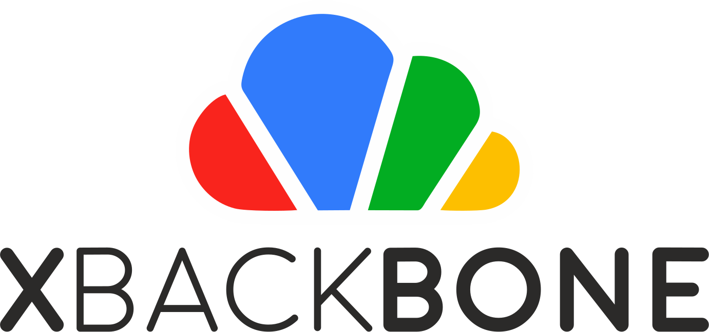

  

XBackBone is a simple, self-hosted, lightweight PHP file manager that support the instant sharing tool ShareX and *NIX systems. It supports uploading and displaying images, GIF, video, code, formatted text, and file downloading and uploading. Also have a web UI with multi user management, past uploads history and search support.
